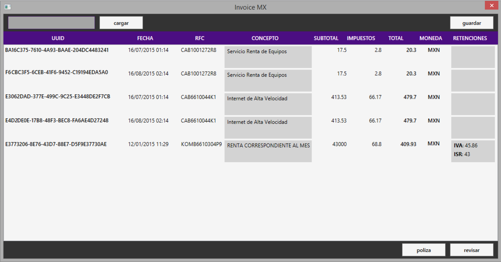

# InvoiceMX
Invoice application for managing CFDI files (.NET)

### Features

- **Import**
	- Import a group of CFDI files from a folder
- **View**
	- Invoice description
	 	- UUID
	 	- Date
	 	- Products & services
		- Subtotal
		- Taxes
		- Total
		- Currency
		- Taxes retention
- **Check**
	- Check for duplicate registers
- **Export**
	- Set export templates
	- Export to Excel (CSV)
	- Export selection to folder

### Preview

	

